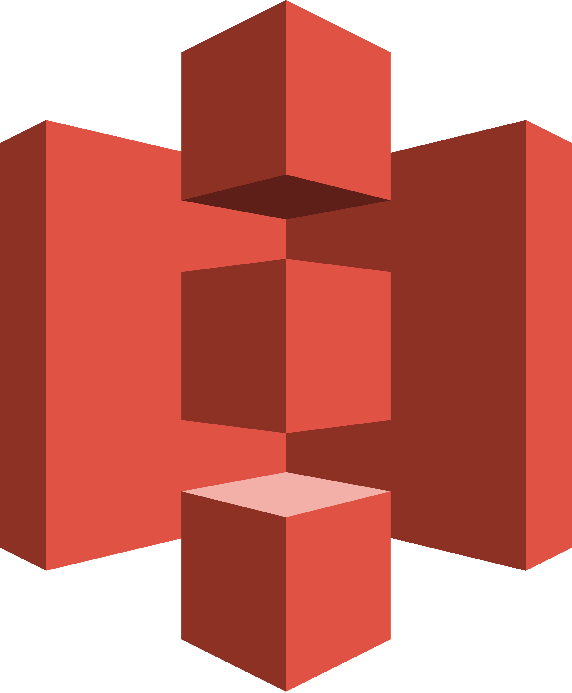

# TABLE OF CONTENT

[Introduction](#✨-introduction)
[Languages](#🏁-languages)
[Tech Stack](#⚜️-tech-stack)
[Tech Breakdown](#tech-breakdown)
[Features](#❇️-features)
[Installation](#💻-installation)
[Usage](#🚀🚀-usage)
[License](#license)
[Future Updates](#future-updates-and-additions)

## ✨ Introduction

Welcome to Vibely – your vibrant social hub! 🌟 Connect with friends and loved ones effortlessly through posts and messages. Share your journey, celebrate wins, and stay close to those who matter most. Join us in crafting authentic connections and creating a more vibrant you. Welcome to Vibely, where every moment sparks a deeper connection. 🌈✨

## 🏁 Languages

    

    

## ⚜️ Tech Stack

    

    

    

    

    

    

    

    

## Tech Breakdown

-   **PHP:** Vibely leveraged PHP as its server-side scripting language, powering the backend logic and server functionalities to handle dynamic content and database interactions.

-   **JavaScript and Vue.js:** The frontend of Vibely was enriched with dynamic and responsive features through JavaScript, with Vue.js playing a key role in creating interactive user interfaces and handling client-side data.

-   **Laravel:** As the PHP web application framework, Laravel facilitated the rapid development of Vibely by providing a robust, expressive syntax and a variety of tools for tasks like routing, authentication, and database management.

-   **Inertia:** Inertia.js was used to seamlessly link Laravel on the backend with Vue.js on the frontend, enabling a single-page application experience without sacrificing the benefits of a traditional server-driven architecture.

-   **Jetstream:** Laravel Jetstream provided a pre-built application scaffolding, accelerating the development process by offering authentication, teams, and API support, along with the benefits of Laravel's ecosystem.

-   **Tailwind CSS:** Vibely adopted Tailwind CSS for a utility-first approach to styling, streamlining the design process and ensuring a consistent and visually appealing user interface across the platform.

-   **AWS S3:** Amazon S3, a scalable object storage service, was integrated into Vibely to efficiently manage and store static assets, ensuring reliable and secure content delivery.

## ❇️ Features

-   **User Authentication:** Secure and easy-to-use authentication system for user accounts.
-   **Email Verification:** Ensures the validity of user email addresses for enhanced security.
-   **User Authorization:** Granular control over user permissions and access levels.
-   **Post Management:** Create and view posts, including the ability to like and comment on posts.
-   **Comment System:** Engage in discussions by commenting on both posts and other comments.
-   **Friend Requests:** Send and receive friend requests to connect with others.
-   **In-App Notifications:** Stay informed with real-time notifications about friend requests, likes, and comments.

## 💻 Installation

To install Vibely, follow these steps:

1. Clone the repository:
   `git clone https://github.com/your-username/vibely.git`
2. Install dependencies:
   `composer install && npm install`
3. Configure environment variables: Set up your .env file with necessary credentials and configurations.

4. Run migrations:
   `php artisan migrate`
5. Build assets:
   `npm run dev`
6. Serve the application:
   `php artisan serve`

## 🚀🚀 Usage

-   Register for a new account on Vibely.
-   Explore and connect with other users.
-   Share posts, like and comment on content.
-   Manage friend requests through the dedicated interface.
-   Stay updated with real-time in-app notifications.

## Future Updates and Additions

-   Adding Real-time messaging using web sockets, Pusher and Laravel Echo

## 🧑🏾 Author

### Solomon Akpuru

-   [LinkedIn Handle](https://www.linkedin.com/in/solomon-akpuru)
-   [GitHub Profile](https://github.com/solobarine)
-   [WellFound Profile](https://wellfound.com/u/solomon-akpuru)
-   [Contra Profile](https://contra.com/solomon_akpuru)

## LICENSE

Vibely is open-sourced software licensed under the [MIT license](https://opensource.org/licenses/MIT).
